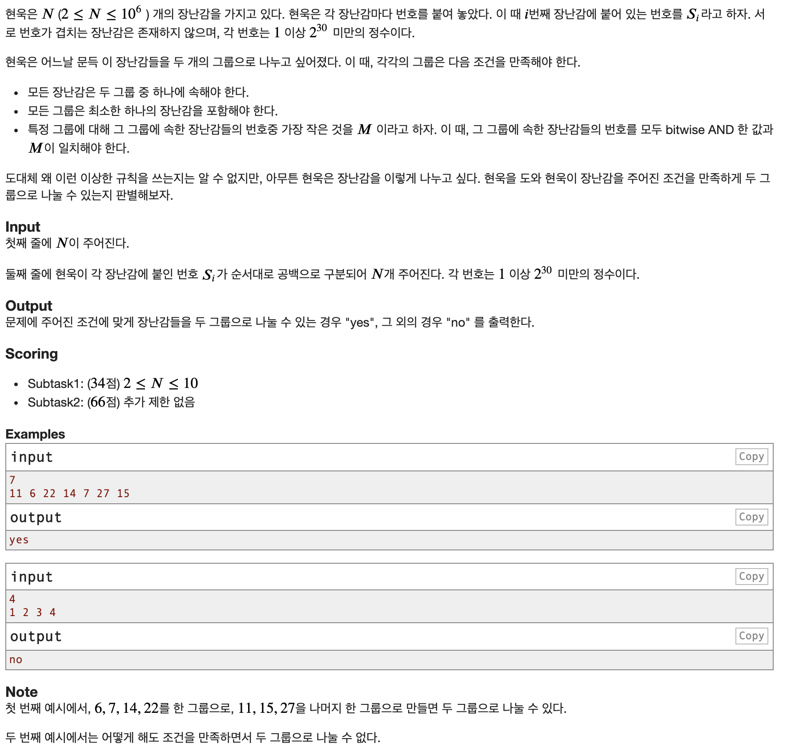
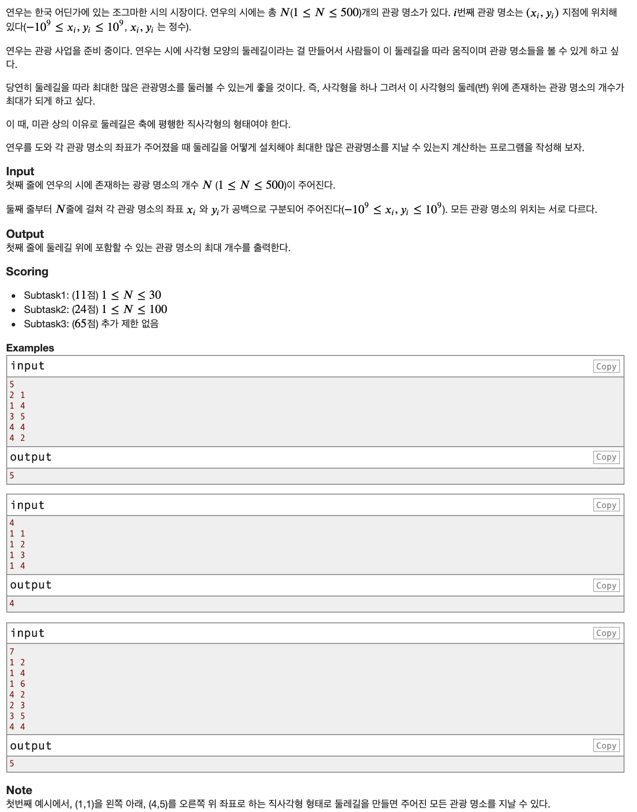
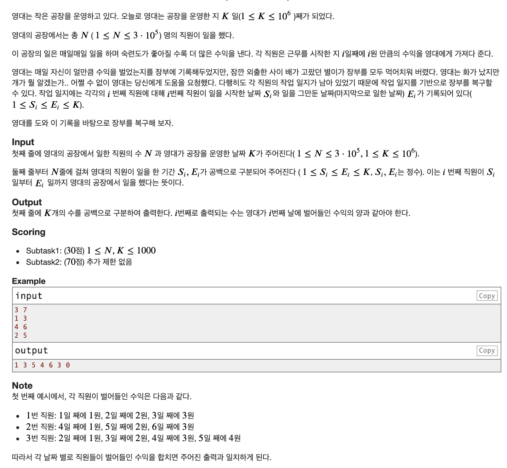

# Prompt412 Special Round 2 참여 후기 및 풀이

<blockquote class="twitter-tweet">
 <a href="https://t.co/Qg9xloVpOf">https://t.co/Qg9xloVpOf</a>  내일 제가 운영하고 있는 ps소모임에서 직접 만든 문제로 연습 대회를 진행할 예정입니다. (오전 11:15부터 2시간) 난이도는 코드포스 div3정도고 좀 교육적인 문제로 준비했어요. 관심 있으신 분들은 한 번 참가해보세용 
&mdash; 즈우북 (@nong____) <a href="https://twitter.com/nong____/status/1284131216946388992?ref_src=twsrc%5Etfw">July 17, 2020</a></blockquote> 

즈우북(a.k.a 농)님이 운영하고 계시는 PS 소모임에서 연습 대회를 진행한다는 트윗을 보게 되었다. PS 환경도 세팅할겸 
해서 오랜만에 대회에 참여해 보았다.

3문제가 나왔고, 대회 시간내에 2문제를 풀었고 대회가 끝나고 1문제를 마저 풀었다. 난이도 자체는 어렵지 않고 괜찮은 문제들이다.

## A번 - 장난감 분류

### 문제
시간 제한 2초
메모리 제한 256MB

### 풀이

일단 관찰할 수 있는 사실은 장난감에 붙인 번호 중 최소 번호가 하나 있을것이다. 이를 A라 하자. A는 두개의 그룹으로 나누었을때도 A가 속한 그룹에서의 최소일것이다. 그러면 A가 속한 그룹은 전부 A랑 AND를 해서 A가 나오는 수들이다. 다른 그룹에서의 최소의 수를 B라고 할때 A랑 AND연산을 해서 A가 되지 않는 수들 중 최소인 수라 할 수 있다. 이 때 모든 수가 A또는 B와 AND연산을 해서 A또는 B가 된다면 yes 아니면 no를 출력하면 된다.

## B번 - 둘레길

### 문제
시간 제한 2초
메모리 제한 256MB

### 풀이

N^3으로만 풀면 된다. N^2logN 풀이가 있는지는 조금 더 고민해 봐야겠지만 출제자 피셜로는 없는것 같다고 한다. 좌표압축을 한다음에 왼쪽 변, 오른쪽 변, 위 변을 고정하고 아랫변의 최솟값을 빠르게 찾으면 된다.

## C번

### 문제

시간 제한 2초
메모리 제한 25MB

### 풀이

나이브하게 풀면 당연히 시간초과이다. 누적합을 2번 이용하여서 풀 수 있다. 어떠한 곳에 `0 1 2 3 4 0 0`와 같이 더하고 싶다면 먼저 `0 1 1 1 1 -4 0`와 같이 수를 더한다음에 누적합을 구하면 된다. 여기서 그냥 구간 업데이트 쿼리를 레이저 세그먼트 트리로 해도 되지만 이러면 30점 밖에 얻질 못하였다. 여기서 한번도 누적합을 통해 저 수를 생성하는 누적하 배열을 생각해보면 `0 1 0 0 0 -5 4`와 같이 배열을 저장하면 된다.

